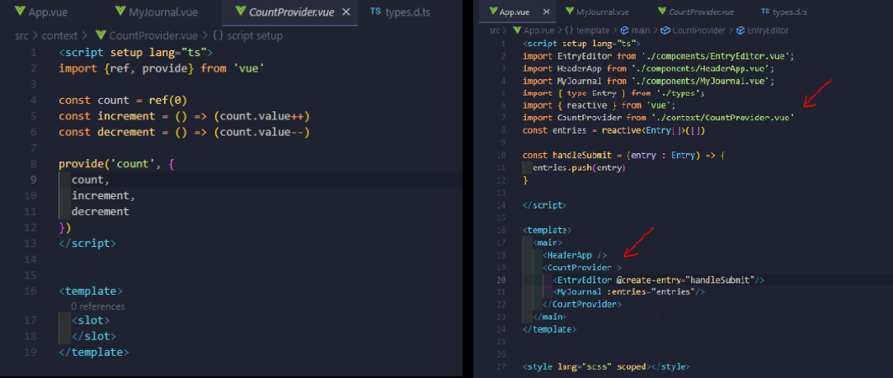

# ts-inject-provide

It is not an event bus, it is not Vuex and it is not Pina. It is an example of how I would use vue's inject and provider.
Excellent for managing an almost decentralized state.
I invite you to explore the CountProvider, App, EntryEditor and MyJournal files.
With CounterProvider we develop a wrapper component that provides us with a controlled state.



## Type Support for `.vue` Imports in TS

TypeScript cannot handle type information for `.vue` imports by default, so we replace the `tsc` CLI with `vue-tsc` for type checking. In editors, we need [Volar](https://marketplace.visualstudio.com/items?itemName=Vue.volar) to make the TypeScript language service aware of `.vue` types.

## Customize configuration

See [Vite Configuration Reference](https://vitejs.dev/config/).

## Project Setup

```sh
npm install
```

### Compile and Hot-Reload for Development

```sh
npm run dev
```

### Type-Check, Compile and Minify for Production

```sh
npm run build
```

### Lint with [ESLint](https://eslint.org/)

```sh
npm run lint
```
